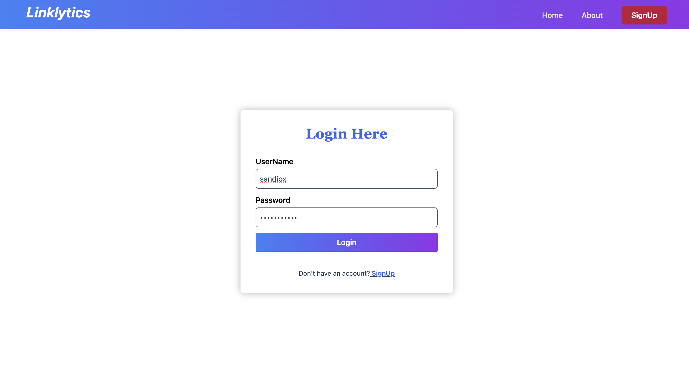
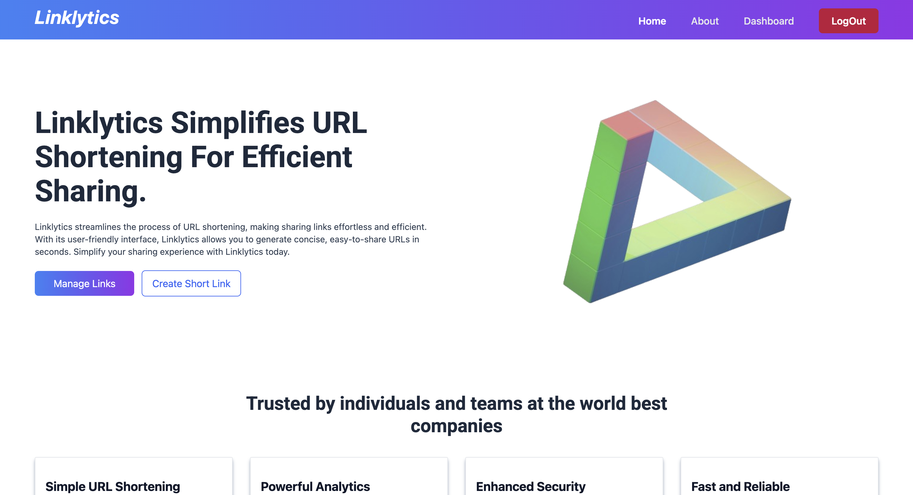
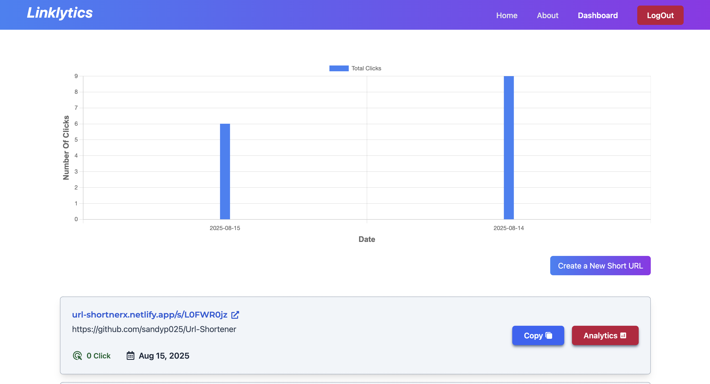

# **Linklytics – Advanced URL Shortener**

[](./LICENSE)
[](https://react.dev/)
[](https://vitejs.dev/)
[](https://tailwindcss.com/)
[](https://spring.io/projects/spring-boot)
[](https://www.postgresql.org/)
[](https://www.docker.com/)
[](https://www.netlify.com/)
[](https://render.com/)


> A modern, full-stack URL shortening application with user authentication, analytics, and responsive UI.
> **Frontend:** React (Vite) deployed on Netlify
> **Backend:** Spring Boot + PostgreSQL (NeonDB) deployed on Render (Dockerized)

🔗 **Live Demo:** [Frontend](https://clipo.co.in/) 

## 📚 Table of Contents
- [Screenshots](#screenshots)
- [Features](#features)
- [Tech Stack](#🛠-tech-stack)
- [Project Structure](#📂-project-structure)
- [Setup & Installation](#⚙️-setup--installation)
- [API Endpoints](#📡-api-endpoints)
- [Error Handling](#🛑-error-handling)
- [License](#📝-license)
- [Future Improvements](#📌-future-improvements)
- [Contributing](#🤝-contributing)
- [Contact](#📬-contact)


## **Features**

* **User Authentication** – Secure login/signup with JWT.
* **Short URL Generation** – Create custom short URLs for any valid link.
* **Analytics Dashboard** – Track clicks with date-wise charts.
* **Responsive UI** – Mobile-first design.
* **Backend API** – RESTful endpoints with input validation.
* **Database** – Cloud-hosted NeonDB (PostgreSQL).
* **Deployment** –

  * **Frontend:** Netlify
  * **Backend:** Render (Docker container)
* **MIT Licensed** – Fully open-source.

---


---
## Screenshots

### Loginpage View


### Homepage View


### Dashboard View

---

## **🛠 Tech Stack**

**Frontend:**

* React (Vite)
* Tailwind CSS
* Axios
* React Router
* React Copy to Clipboard

**Backend:**

* Spring Boot
* PostgreSQL (NeonDB)
* JPA/Hibernate
* Docker

**Deployment:**

* **Frontend:** Netlify
* **Backend:** Render (Docker image)

---

## **📂 Project Structure**

```
Url-Shortener/
│
├── Url-Shortener-Frontend/     # React frontend
│   ├── public/
│   ├── src/
│   │   ├── components/
│   │   ├── pages/
│   │   └── App.jsx
│   ├── vite.config.js
│   └── package.json
│
├── src/                        # Spring Boot backend
│   ├── main/java/com/...
│   └── main/resources/
│
├── pom.xml                     # Backend dependencies
├── Dockerfile                  # Backend Docker config
├── LICENSE                     # MIT License
└── README.md                   # Project documentation
```

---

## **⚙️ Setup & Installation**

### **1️⃣ Clone the Repository**

```bash
git clone https://github.com/sandyp025/Url-Shortener.git
cd Url-Shortener
```

### **2️⃣ Backend Setup**

```bash
cd Url-Shortener
# Configure environment variables in .env or application.properties
./mvnw spring-boot:run
```

**Environment Variables (.env):**

```env
DB_URL=jdbc:postgresql://<neondb-url>
DB_USERNAME=<username>
DB_PASSWORD=<password>
JWT_SECRET=<jwt-secret>
FRONTEND_URL=https://your-netlify-url
```

---

### **3️⃣ Frontend Setup**

```bash
cd Url-Shortener-Frontend
npm install
npm run dev
```

**Frontend `.env`:**

```env
VITE_BACKEND_URL=https://<your-backend-url>
```

---

### **4️⃣ Docker Build (Backend)**

```bash
docker build -t url-shortener-backend .
docker run -p 8080:8080 url-shortener-backend
```

---

## **📡 API Endpoints**

| Method | Endpoint                | Description              |
| ------ | ----------------------- | ------------------------ |
| POST   | `/api/auth/signup`      | Register new user        |
| POST   | `/api/auth/login`       | Login & get JWT          |
| POST   | `/api/urls/shorten`     | Shorten a URL            |
| GET    | `/api/urls/{shortCode}` | Redirect to original URL |
| GET    | `/api/urls/stats`       | Get analytics            |

---

## **🛑 Error Handling**

* Returns proper HTTP status codes.
* Input validation for URLs.
* Returns 400 for invalid URLs, 500 only for server errors.
* Max URL length capped at 2048 characters.

---

## **📝 License**

This project is licensed under the [MIT License](./LICENSE).

---

## **📌 Future Improvements**

* Custom aliases for short URLs.
* Expiration dates for links.
* QR code generation.

## 🤝 Contributing
Contributions are welcome! Please fork the repo and submit a pull request.


## 📬 Contact
Developed by [Sandip Mandal](https://github.com/sandyp025) – feel free to reach out!


---